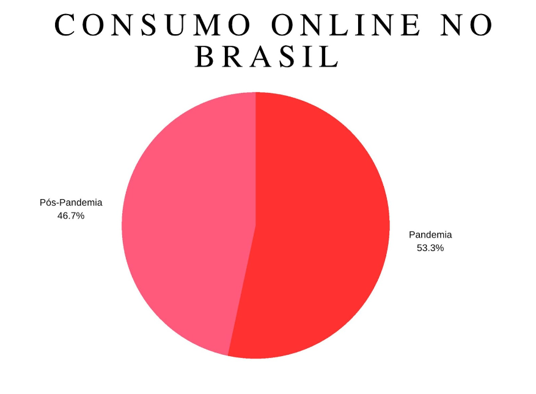

# Introdução

O uso da tecnologia no Séc. XXI cada vez mais tem diminuído a distância na comunicação entre indivíduos, isso se dá segundo Silveira et. al. (2006), pois o uso da tecnologia permite a integração entre diversas áreas, o intercâmbio de informações, a propagação de informação e por fim, o conhecimento. Celulares, tablets e computadores têm aumentado de forma significativa as interações entre usuários, tudo por advento da internet, com isso é necessário filtrar informações com o intuito de maximizar a experiência dos navegantes web. Segundo a Confederação Nacional de Dirigentes Lojistas (CNDL) divulgada em setembro de 2021, 91% dos consumidores conectados realizaram alguma compra em lojas online entre 2020 e 2021. Desse total, 87% utilizaram o smartphone para concluir o negócio. 

Uma parcela que é bastante afetada pela inadequada filtragem de informações, são os consumidores gastronômicos, que enfrentam dificuldades na busca por recomendações. A estratégia de reviews do Google por exemplo permite que usuários da ferramenta de busca veja informações relevantes acerca da empresa ou estabelecimento que estes possuem interesse, visando assim facilitar a escolha a partir da vivência de outros usuários da plataforma.

Apesar da inflação de insumos, a estimativa do setor gastronômico é de um crescimento de 20% no faturamento frente ao último carnaval (2021), é o que afirma a conselheira da Associação Brasileira de Bares e Restaurantes (Abrasel-MG). Nesse panorama é importante frisar o uso consciente das informações obtidas via experiência empírica, e como estas estimulam ou abatem futuras experiências de terceiros. 

É perceptível o alto número de restaurantes sendo inaugurados, sendo tanto de culinária tradicional como especializadas para certos nichos, grupos da sociedade. Essas mesmas empresas buscam se diversificar realizando propagandas inovadoras, através de posts em redes sociais e outras ferramentas de marketing, mas ficam à mercê de um algoritmo que muitas vezes oscila e acaba prejudicando o alcance para com os clientes.
Além disso, houve um aumento massivo no consumo de alimentos e produtos via aplicativo pelo advento da pandemia da Covid-19. Contudo mesmo após-pandemia o efeito do consumo via aplicativo não voltou às marcas anteriores, se tornando o meio mais usado por usuários da internet para consumir alimentos na atualidade. Consta na pesquisa disponível no site da Agência Brasil que “Para o período pós-pandemia, a pesquisa indica possível queda desse hábito entre os brasileiros, mas, quando considerados os que pretendem continuar com esse hábito diário, o percentual cai de 22,1% para 20%. A estimativa de 57,8% das pessoas ouvidas é manter a prática.” VALENTE, Jonas. Segue em anexo um gráfico discriminando a relação de consumo online no Brasil no pico Pandêmico e Pós-Pandemia.

Diante disso se torna necessário desenvolver uma aplicação web para buscar e filtrar as experiências dos usuários que frequentam restaurantes e lanchonetes de forma mais interativa, um lugar onde se possa criar amizades e realizar encontros gastronômicos, através de avaliações, comentários e indicações das pessoas que já estiveram em tais estabelecimentos, facilitando ao usuário a realização de uma escolha plausível com base em seus interesses e relatos de outros usuários da rede. 

## Problema
Este projeto visa dirimir a falta e/ou a filtragem de informação para os perfis da rede na busca por restaurantes, pois os meios já existentes não são suficientes ou funcionam de forma individual – redes sociais, propagandas – para demonstrar as experiências vivenciadas por outros consumidores. Um lugar onde o usuário consiga se relacionar através de uma rede interacional com outros a partir da criação de perfis, postagens, “stories” com o objetivo de ser mais do que somente uma ferramenta de recomendação, mas um lugar de interação social.

## Objetivos

O foco de atuação deste trabalho é a criação de uma aplicação web que apresenta, segundo informações já disponibilizadas pelo usuário, os restaurantes que seguem as características compartilhadas, a quantidade de avaliações daquele local assim como comentários e fotos dos consumidores, facilitando a escolha dentro dos requisitos pesquisados.

Como objetivos específicos, podemos ressaltar:
 
> - Fornecer funcionalidades que permitam filtrar informações chaves relativas a busca por restaurantes;
> - Interagir com outros usuários, através de comentários, buscando informações e dicas sobre aquele estabelecimento;
> - Liberdade para avaliar, comentar e interagir dentro do aplicativo;
> - Postagem de Fotos e Vídeos, por meio de publicações no feed ou no stories da rede. 
> - Permitir a criação de canais personalizados por usuário com tópicos de interesse individual.

## Justificativa

A qualidade percebida é definida por julgamentos do consumidor sobre a excelência ou superioridade global do produto (ANDERSON et al., 1994; BEI; CHIAO, 2001). Para prestadores de serviços, a qualidade do produto e ou serviço pode ser definida como a avaliação que o cliente faz do serviço, durante ou após o término do processo. Esta avaliação se dá através da comparação entre o que o cliente esperava e o que ele percebeu do serviço prestado (GIANESI; CORRÊA, 1994).

Seguindo então o pensamento de Gianesi Corrêa, o desenvolvimento desta ferramenta web, se baseia na criação de um espaço aberto para comparações e recomendações entre usuários a partir das expectativas destes. Compartilhando suas trajetórias desde buscar em nossa plataforma até o momento de degustação  das diversas culinárias presentes na cidade selecionada pelo usuário com o intuito diminuir a desinformação e facilitar a divulgação de estabelecimentos. 

## Público-Alvo

É inegável que a ferramenta de busca do Google tem facilitado cada vez mais o encontro de informações relevantes, todavia houve também um aumento no número de “fake news” a partir da criação de perfis falsos que podem passar de forma despercebida com usuários reais da rede. Tais perfis, criados por ferramentas de construção de engajamento falso, criam perfis e reviews que não condizem com a realidade. Quem mais sofre com tal falta de informações confiáveis é o consumidor que não consegue encontrar uma fonte relevante e condizente com a realidade. 

Sendo assim, estabeleceu-se como público-alvo desta solução os homens e as mulheres entre 16 e 35 anos que encontram dificuldades na busca por espaços gastronômicos na sua região, com informações reais de outros usuários. 